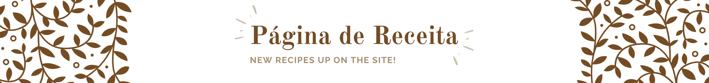

  

---

> ### **Página de Receita**

  

    Em desenvolvimento!
  

  <a href="https://www.figma.com/pt-br/comunidade/file/1360315130061454535/pagina-de-receita">
    
    
<strong>Layout</strong>

  </a>

**Índice:**

  - [X] Iniciando o projeto
  - [X] Estrutura HTML inicial
  - [X] Adicionando imagens e estilos
  - [ ] Imagem de fundo e container page
  - [ ] Trabalhando as fontes
  - [ ] Personalizando espaços
  - [ ] Adicionando o rodapé

  

    <strong>Ferramentas:</strong> VScode, Git, HTML, CSS
  

---

Feito com ❤ by Igor 🖖
